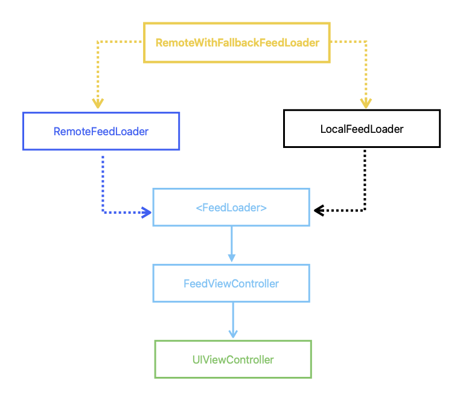

[](https://app.bitrise.io/app/2286a568849c20be)

# FeedFramework
iOS Lead Essentials Feed Framework

# Image Feed Requirements



# User Story

## Story: Customer requests to see the feed

## Narrative 1
> as an online customer
> I want the app to automatically load my image feed
> So I can always enjoy the newest images of my friends

### Acceptance Criteria
```
Given the customer has an internet connection
When the customer requests to see the feed
Then the app should display the latest feed from remote, and update the cache with the new feed
```

## Narrative 2
> As an offline customer
> I want the app to show the latest cached version of my image feed
> So I can always enjoy images of my friends

### Acceptance Criteria
```
Given the customer doesn't have connectivity
When the customer requests to see the feed
And the feed is < 7 days old
then the app should display the most recent cached feed
```

```
Given the customer does not have connectivity
and the cache is empty/expired
When the customer requests to see the feed
Then the app should display an error message
```

# Use Case

# Load Feed

## Data:
- URL

## Primary course (happy path):
1. Execute "Load Feed Items" command with above data.
2. System downloads data from the URL.
3. System validates the downloaded data.
4. System creates feed items from valid data.
5. System delivers feed items.

## Invalid data - error course (sad path):
1. system delivers error

## No Connectivity - error course (sad path):
1. system delivers error message

## Example Payload

```
GET *url* (TBD)

200 RESPONSE

{
	"items": [
		{
			"id": "a UUID",
			"description": "a description",
			"location": "a location",
			"image": "https://a-image.url"
		},
		{
			"id": "a UUID",
			"description": "a description",
			"image": "https://a-image.url"
		},
		{
			"id": "a UUID",
			"location": "a location",
			"image": "https://a-image.url"
		},
		{
			"id": "a UUID",
			"image": "https://a-image.url"
		}
	]
}
```


